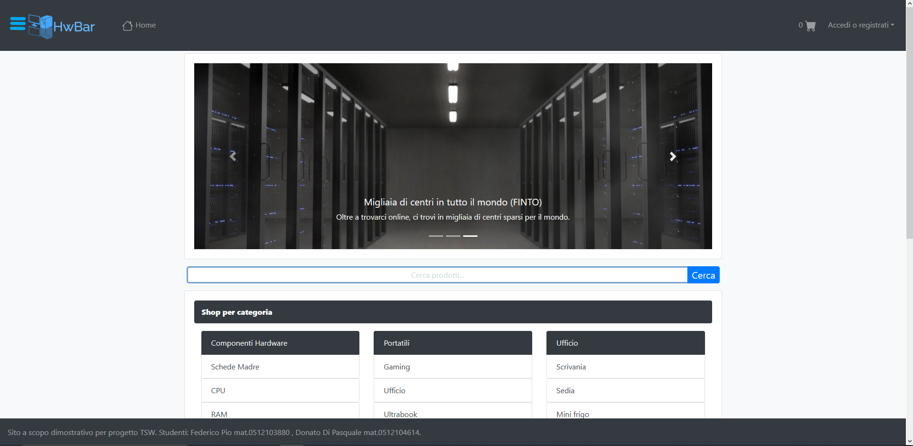
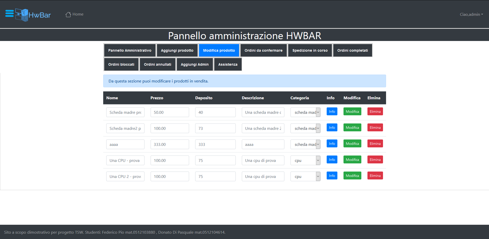

# HWBAR
Progetto Tecnologie Software per il Web  2020 Università degli Studi di Salerno.

• Java
• MySQL
• HTML
• CSS
• JAVASCRIPT
• AJAX
• BOOTSTRAP
----------------
• JDK 13 
• Tomcat 9.0.41

Don't use this for cheat.

Federico Pio(https://github.com/fedepio) , 
Donato Di Pasquale

# HOMEPAGE - DEMO

----------------------------------
# BACKOFFICE - DEMO

